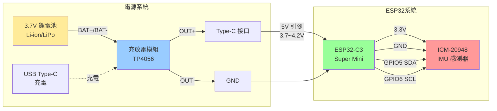
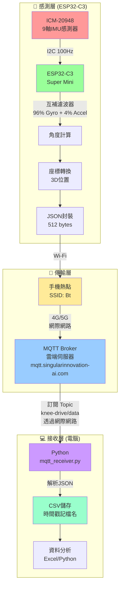
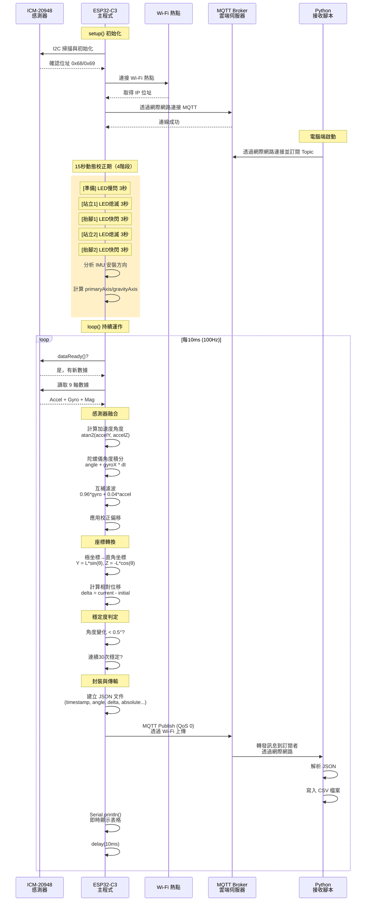
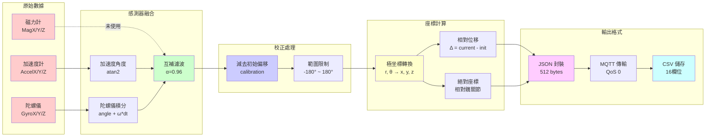

# 膝蓋抬腿動作分析系統 (Knee Drive Analysis)

## 專案簡介

本專案使用 ESP32-C3 與 ICM-20948 IMU 感測器，透過 **Wi-Fi + MQTT** 無線傳輸即時分析跑步時的膝蓋抬腿動作。系統可記錄大腿角度、膝蓋位置座標等數據，量化分析不同抬腿高度對跑步效率的影響。

### 核心特色

- ✅ **9 軸 IMU 感測器**：高精度動作追蹤
- ✅ **無線資料傳輸**：透過 MQTT 即時上傳雲端
- ✅ **4 階段動態校正**：站 → 抬 → 站 → 抬，自動偵測 IMU 安裝方向
- ✅ **LED 視覺提示**：校正各階段有明確的燈號指示
- ✅ **即時座標計算**：膝蓋 3D 位置追蹤
- ✅ **CSV 資料儲存**：完整記錄供後續分析

## 硬體配置

### 開發板

- **ESP32-C3 Super Mini**
  - 基於 RISC-V 架構的 ESP32-C3 晶片
  - 支援 Wi-Fi 和 Bluetooth
  - 內建 USB 功能
  - 工作電壓：3.3V (晶片) / 5V (供電輸入)

### 感測器

- **ICM-20948 (GY-ICM20948)**
  - 9 軸慣性測量單元 (IMU)
  - 3 軸加速度計 + 3 軸陀螺儀 + 3 軸磁力計
  - I2C 通訊介面
  - I2C 位址：0x68 或 0x69 (自動偵測)

### 電源系統

- **鋰電池**: 3.7V (標稱電壓) / 4.2V (充滿) / 3.0V (放電截止)
- **充放電模組**: TP4056 或類似模組
- **供電方式**: Type-C 接口為 ESP32-C3 Super Mini 供電

### 系統電路圖



### 接線配置

#### ICM-20948 ↔ ESP32-C3 Super Mini

| ICM-20948 | ESP32-C3 Super Mini        |
| --------- | -------------------------- |
| VCC       | 3.3V                       |
| GND       | GND                        |
| SDA       | GPIO 5                     |
| SCL       | GPIO 6                     |
| AD0       | 懸空 (0x68) 或 3.3V (0x69) |
| INT       | 未使用                     |

#### 充放電模組 ↔ ESP32-C3 Super Mini

| 充放電模組 | ESP32-C3 Super Mini |
| ---------- | ------------------- |
| OUT+       | 5V (透過 Type-C)    |
| OUT-       | GND                 |
| BAT+       | 鋰電池正極          |
| BAT-       | 鋰電池負極          |

**注意事項**：

- GPIO5/6 用於 I2C 以避免 GPIO8/9 的啟動問題（strapping pins）
- ESP32-C3 Super Mini 的 5V 引腳可接受 3-6V 輸入，內建穩壓器會轉換為 3.3V
- 鋰電池電壓範圍 3.0V-4.2V 完全在安全範圍內
- 使用充放電模組可保護電池過充/過放，延長電池壽命

## 軟體環境

### ESP32 開發環境

- **開發平台**: PlatformIO
- **框架**: Arduino
- **主控晶片**: ESP32-C3
- **程式語言**: C++
- **通訊協定**: Wi-Fi + MQTT

### 資料接收環境

- **程式語言**: Python 3.x
- **必要套件**: paho-mqtt
- **資料格式**: JSON → CSV

## 系統架構與資料流程

### 整體系統架構



### 韌體運作流程



### 資料處理管線



### 核心演算法說明

#### 1. 互補濾波器 (Complementary Filter)

```cpp
// 融合加速度計與陀螺儀數據
float alpha = 0.96;  // 信任係數
float accelAngle = atan2(accelY, accelZ) * 180.0 / PI;  // 重力方向
float gyroAngle = thighAngle + gyroX * deltaTime;        // 角速度積分
thighAngle = alpha * gyroAngle + (1 - alpha) * accelAngle;
```

**設計理由**：

- 加速度計受重力影響穩定，但易受振動干擾（高頻雜訊）
- 陀螺儀短期精確，但長期會累積誤差（漂移）
- 96:4 的比例在動態運動中達到最佳平衡

#### 2. 動態校正系統（4 階段）

系統採用 **4 階段動態校正**，自動偵測 IMU 安裝方向，每階段 3 秒：

```
時間:     0      3      6      9      12     15秒
         |------|------|------|------|------|
狀態:    準備   站立1  抬腳1  站立2  抬腳2  完成
LED:     慢閃 → 熄滅 → 快閃 → 熄滅 → 快閃 → 熄滅
```

##### 校正流程說明

| 階段 | 狀態          | 時間 | LED 行為           | 使用者動作     |
| ---- | ------------- | ---- | ------------------ | -------------- |
| 0    | CAL_INIT      | 3 秒 | 慢閃（1 秒週期）   | 準備站好       |
| 1    | CAL_STAND_1   | 3 秒 | **熄滅**           | 保持站立不動   |
| 2    | CAL_LIFT_1    | 3 秒 | 快閃（500ms 週期） | 抬起膝蓋至水平 |
| 3    | CAL_STAND_2   | 3 秒 | **熄滅**           | 保持站立不動   |
| 4    | CAL_LIFT_2    | 3 秒 | 快閃（500ms 週期） | 抬起膝蓋至水平 |
| 5    | CAL_ANALYZING | 瞬間 | 超快閃             | 等待分析完成   |
| 6    | CAL_COMPLETE  | -    | 熄滅               | 開始正常測量   |

> ⚠️ **注意**：使用者實際會觀察到 **3 次「閃爍 → 熄滅」的轉換**（準備結束、抬腳 1 結束、抬腳 2 結束），這是正常現象。

##### LED 指示燈速查表

| LED 狀態             | 意義     | 你應該做什麼       |
| -------------------- | -------- | ------------------ |
| 慢閃（1 秒週期）     | 準備中   | 站好不動，等待開始 |
| **熄滅**             | 站立階段 | 保持站立姿勢不動   |
| 快閃（500ms 週期）   | 抬腳階段 | 將膝蓋抬至水平位置 |
| 超快閃（300ms 週期） | 分析中   | 等待，即將完成     |
| 熄滅（永久）         | 校正完成 | 開始跑步測試       |

##### 校正原理

系統透過比較站立與抬腳時的加速度差異，自動判斷：

- **primaryAxis**：主要運動軸（膝蓋抬起方向）
- **gravityAxis**：重力軸（站立時的垂直方向）
- **axisSign**：角度正負方向

這使得 IMU 可以任意角度安裝，系統會自動適應。

#### 3. 座標轉換公式

```cpp
// 極坐標 → 直角座標（髖關節為原點）
float angleRad = calibratedAngle * PI / 180.0;
kneeY = THIGH_LENGTH * sin(angleRad);   // 前後位移 (0~45cm)
kneeZ = -THIGH_LENGTH * cos(angleRad);  // 上下位移 (-45~0cm)
```

**座標系定義**：

- 原點 (0, 0, 0)：髖關節位置
- Y 軸：前後方向（正值 = 往前）
- Z 軸：上下方向（負值 = 往下）
- 站立時：kneeZ ≈ -45cm（膝蓋在髖關節正下方）

## 專案結構

```
knee-drive-analysis/
├── platformio.ini          # PlatformIO 配置文件
├── src/
│   └── main.cpp           # ESP32 主程式 (Wi-Fi + MQTT)
├── include/               # 標頭檔
├── lib/                   # 專案函式庫
├── test/                  # 測試程式
├── mqtt_receiver.py       # Python MQTT 資料接收腳本
├── USAGE.md               # 詳細使用說明
├── README.md              # 專案說明（本檔案）
└── .github/
    └── copilot-instructions.md  # AI 開發規範
```

## 快速開始

### 步驟 1：硬體準備

1. 按照接線配置連接 ESP32-C3 與 ICM-20948
2. 連接 3.7V 鋰電池到充放電模組（注意正負極）
3. 將充放電模組的輸出透過 Type-C 連接到 ESP32-C3 Super Mini
4. 準備手機開啟 Wi-Fi 熱點（SSID: `Bt`, 密碼: `bt_980904`）
   - ESP32 將透過此熱點連接網際網路
5. 確保電腦可以連接網際網路（用於接收 MQTT 資料）
   - 電腦不需要連接到相同的 Wi-Fi 熱點
   - MQTT Broker 是獨立的雲端伺服器

**電池與充電**：

- 可使用 18650、103450 或其他 3.7V 鋰電池
- 充放電模組建議使用 TP4056（含過充/過放保護）
- 透過充放電模組的 USB 接口可直接充電
- 建議電池容量：1000mAh 以上（續航約 2-4 小時，視 Wi-Fi 使用情況）

### 步驟 2：上傳 ESP32 程式

1. 安裝 [Visual Studio Code](https://code.visualstudio.com/)
2. 安裝 [PlatformIO IDE](https://platformio.org/install/ide?install=vscode) 擴充功能
3. 用 USB 連接 ESP32 到電腦
4. 修改 `src/main.cpp` 中的 Wi-Fi 設定（第 9-10 行）：
   ```cpp
   const char* WIFI_SSID = "你的WiFi名稱";
   const char* WIFI_PASSWORD = "你的WiFi密碼";
   ```
5. 點擊 PlatformIO 的 **Upload** 按鈕

**首次上傳注意**：

- 按住 **BOOT** 按鈕 → 按下 **RESET** → 釋放 → 開始上傳

### 步驟 3：安裝 Python 環境

```bash
# 安裝必要套件
pip install paho-mqtt
```

### 步驟 4：開始資料採集

1. 手機開啟熱點（提供 ESP32 網路連線）
2. ESP32 開機（會自動連接 Wi-Fi 熱點，然後透過網際網路連接 MQTT Broker）
3. 在電腦執行接收腳本（電腦需有網路連線，不需連接到手機熱點）：
   ```bash
   python mqtt_receiver.py
   ```
4. 保持站立 3 秒完成自動校正
5. 開始跑步，資料會即時透過雲端 MQTT 伺服器傳輸並儲存為 CSV

**網路架構說明**：

- ESP32 → 手機熱點 → 網際網路 → MQTT Broker (雲端)
- 電腦 → 網際網路 → MQTT Broker (雲端)
- ESP32 和電腦透過雲端 MQTT Broker 進行資料交換，無需在同一區網

### 完整使用說明

請參閱 [USAGE.md](USAGE.md) 獲取詳細的設定與使用指南。

## 功能特點

### 已完成功能 ✅

- [x] ICM-20948 感測器數據讀取（9 軸 IMU）
- [x] I2C 位址自動偵測（0x68/0x69）
- [x] Wi-Fi 連線功能
- [x] MQTT 無線資料傳輸
- [x] 互補濾波器（96% 陀螺儀 + 4% 加速度計）
- [x] 膝蓋 3D 座標計算（相對髖關節）
- [x] 自動校正系統（3 秒站立校準）
- [x] 穩定度偵測（30 次連續穩定判定）
- [x] 即時資料顯示（序列埠 + MQTT）
- [x] Python 資料接收腳本
- [x] CSV 格式資料儲存
- [x] JSON 格式資料傳輸

### 開發中功能 🚧

- [ ] 跑步效率評估演算法
- [ ] 網頁即時視覺化介面
- [ ] 歷史資料分析工具
- [ ] 多使用者資料管理

## 研究目標

1. **數據收集**：記錄不同跑步速度下的膝蓋運動數據
2. **特徵提取**：分析抬腿高度、頻率、加速度等關鍵指標
3. **效率評估**：建立抬腿高度與跑步效率的關聯模型
4. **最佳化建議**：根據分析結果提供個人化的跑步姿勢建議

## 技術規格

### 硬體規格

- **感測器**: ICM-20948 (9-DOF IMU)
- **取樣頻率**: 約 100 Hz
- **加速度範圍**: ±2g / ±4g / ±8g / ±16g (可設定)
- **陀螺儀範圍**: ±250°/s / ±500°/s / ±1000°/s / ±2000°/s (可設定)
- **磁力計範圍**: ±4900 μT
- **I2C 速度**: 100 kHz (標準模式)
- **工作電壓**: 3.0V - 4.2V (鋰電池供電)
- **工作電流**: 約 80-150mA (Wi-Fi 連線時)
- **待機電流**: 約 40-80mA (Wi-Fi 保持連線)
- **電池續航**: 2-4 小時 (1000mAh 電池)

### 軟體規格

- **序列埠速率**: 115200 baud
- **MQTT QoS**: 0 (最多一次傳送)
- **JSON Buffer**: 512 bytes
- **大腿長度**: 45 cm (可調整)
- **互補濾波**: α = 0.96
- **校正時間**: 3 秒
- **穩定判定**: 連續 30 次 < 0.5°

### 資料格式

- **傳輸格式**: JSON
- **儲存格式**: CSV (UTF-8 with BOM)
- **時間戳記**: 毫秒精度
- **座標系統**: 右手座標系（髖關節為原點）

## 資料輸出格式

### CSV 欄位

| 欄位                | 說明             | 單位  |
| ------------------- | ---------------- | ----- |
| 時間戳記            | 資料接收時間     | -     |
| 運行時間(s)         | ESP32 運行時間   | 秒    |
| 角度(deg)           | 大腿抬起角度     | 度    |
| ΔX/ΔY/ΔZ(cm)        | 相對初始位置位移 | 公分  |
| 絕對 X/Y/Z(cm)      | 膝蓋絕對座標     | 公分  |
| 是否穩定            | 數值穩定狀態     | 是/否 |
| 加速度 X/Y/Z(g)     | 三軸加速度       | g     |
| 陀螺儀 X/Y/Z(deg/s) | 三軸角速度       | deg/s |

### JSON 範例

```json
{
  "timestamp": 3450,
  "elapsed_time": 3.45,
  "angle": 12.5,
  "stable": true,
  "delta": { "x": 0.0, "y": 5.2, "z": 8.3 },
  "absolute": { "x": 0.0, "y": 5.2, "z": -43.7 },
  "accel": { "x": 0.123, "y": 0.045, "z": 0.987 },
  "gyro": { "x": 2.5, "y": -1.3, "z": 0.8 }
}
```

## 故障排除

### 電源與充電問題

- **ESP32 無法開機**
  - 檢查鋰電池電壓（應 > 3.0V）
  - 確認充放電模組輸出正常
  - 檢查 Type-C 連接是否牢固
- **電池快速耗電**
  - Wi-Fi 連線會消耗較多電力（80-150mA）
  - 考慮降低資料傳輸頻率
  - 檢查是否有不必要的序列輸出
- **充電無反應**
  - 確認充電器輸出 5V/1A 以上
  - 檢查充放電模組 LED 指示燈
  - 確認電池連接極性正確

### Wi-Fi 無法連線

- 檢查手機熱點是否開啟
- 確認 SSID 和密碼正確（區分大小寫）
- ESP32 與手機距離保持 5-10 公尺內
- 電池電壓過低可能導致 Wi-Fi 不穩定

### MQTT 發送失敗

- 查看序列埠的「MQTT 狀態」數值
- 確認網路連線正常
- 檢查 MQTT 伺服器是否可用
- 電壓不足時 Wi-Fi 可能斷線

### 資料不穩定

- 重新執行 3 秒校正程序
- 檢查感測器是否牢固安裝
- 確認 I2C 接線正確
- 確保電池供電穩定（電壓 > 3.3V）

## 參考資料

- [ESP32-C3 技術文件](https://www.espressif.com/en/products/socs/esp32-c3)
- [ICM-20948 數據手冊](https://invensense.tdk.com/products/motion-tracking/9-axis/icm-20948/)
- [MQTT 協定說明](https://mqtt.org/)
- [PlatformIO 文件](https://docs.platformio.org/)

## 授權

本專案採用 MIT 授權條款。

## 作者

Knee Drive Analysis Project Team

---

**最後更新**: 2024-11-08
